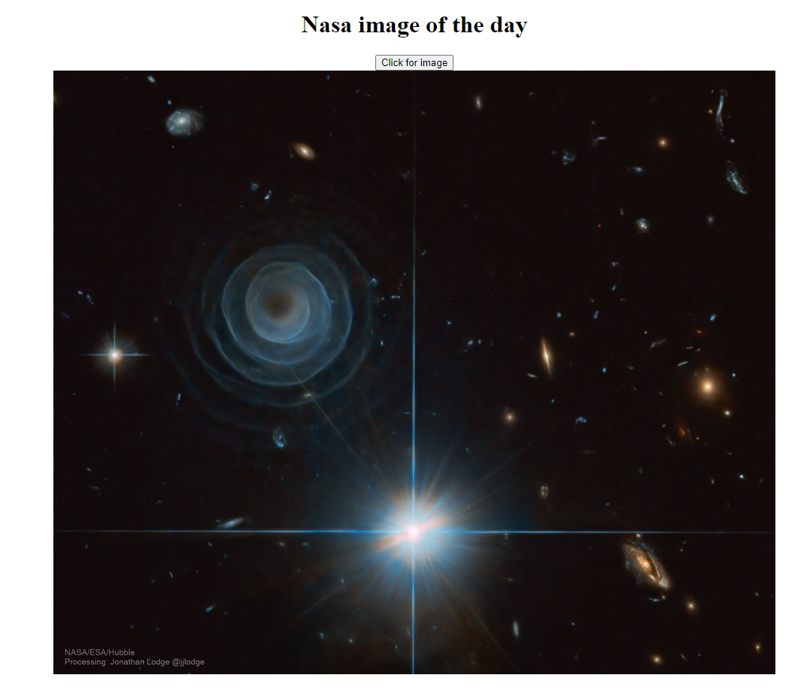

# Nasa
My use of the nasa api, going to expand upon it each day until I use all features of the api.

Currently just displays the image of the day when you click the button but I want to add more to it.
I know it's not pretty I'm gonna add CSS when I have time.

The .PNG new screenshot is the most recent version of how it actually looks, for some reason github isn't letting me put it here :/

